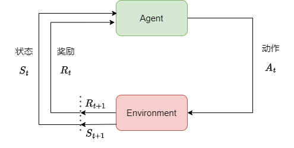
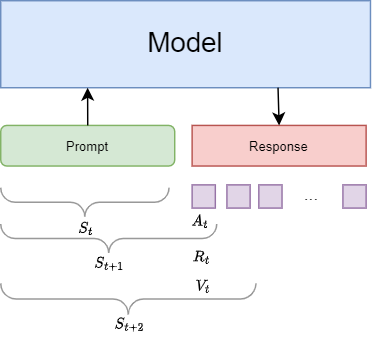
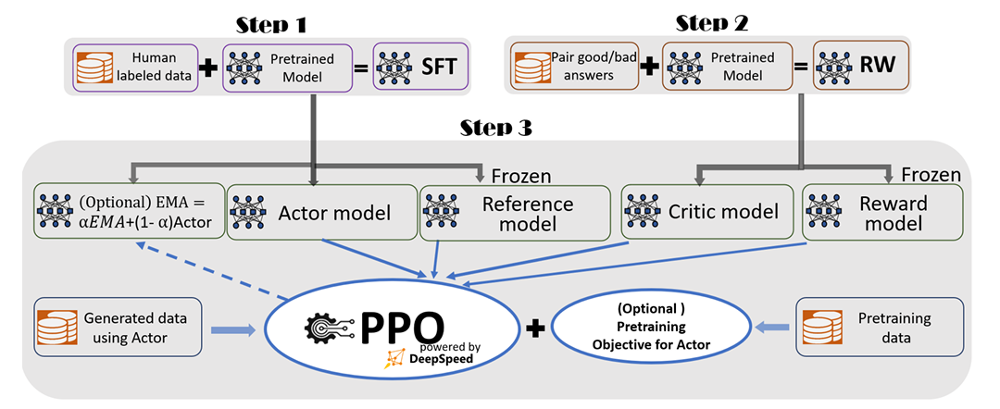
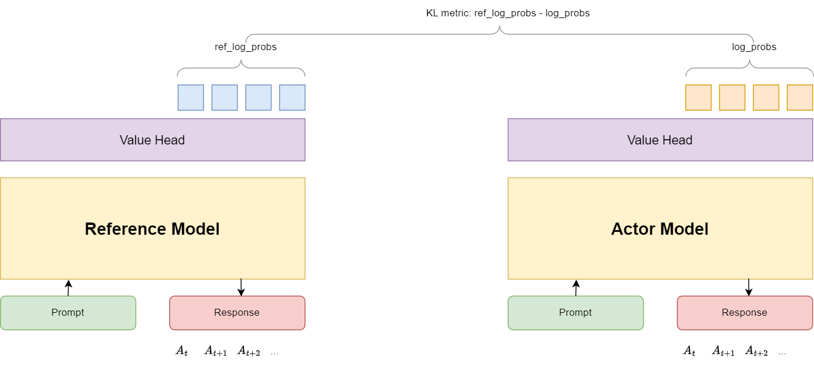
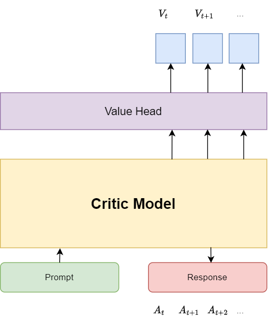
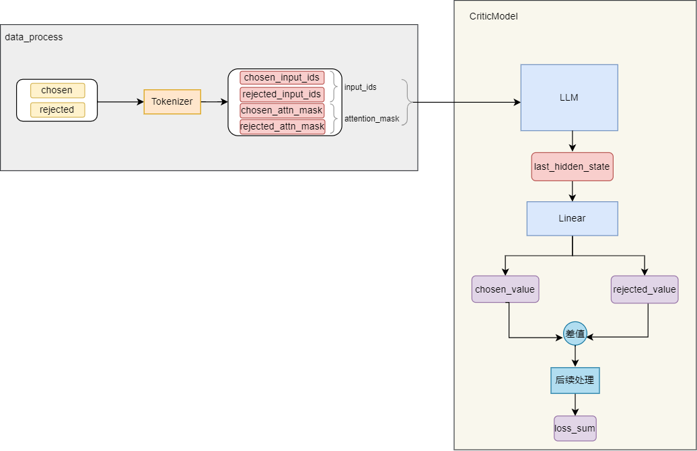
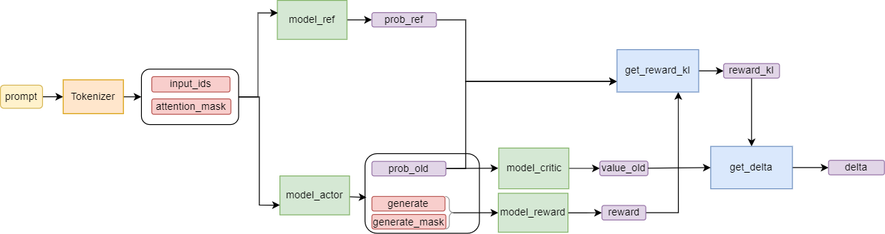

# 强化学习概述

强化学习，RL，Reinforcement Learning，其整体流程如下图所示：



- 强化学习中的两个实体：**智能体（Agent）**和 **环境（Environment）**
- 强化学习中两个实体的交互：
  - **状态空间S**： State，环境中所有可能状态的集合
  - **动作空间A**：Action，智能体所有可能动作的集合
  - **奖励R**：Reward，智能体在环境的某一状态下获得的奖励
- 智能体与环境的交互过程：
  - 在 $t$ 时刻，环境的状态为 $S_t$，此时智能体获得的奖励为 $R_t$
  - 智能体观测到 $S_t$ 和 $R_t$ 后，采取动作 $A_t$ ，环境状态相应变为 $S_{t+1}$，智能体获得奖励 $R_{t+1}$
- 关于强化学习中的价值函数 $V_t = R_t + \gamma V_{t+1}$
  - 首先有 $R_t$ 代表，智能体在状态 $S_t$下的即时奖励
  - 为了更好地衡量当下智能体的动作对整体的影响情况，引入未来收益 $V_{t+1}$，即 $t$ 时刻智能体的总收益 $V_t$ = 状态 $S_t$ 对应的即时收益 $R_t$ + 从状态 $S_t$ 出发能够得到的未来收益 $\gamma V_{t+1}$ 
  - 其中 $\gamma$ 为折扣因子，决定在多大程度上讲未来收益纳入当前收益的考虑，$V_{t+1}$ 为 $t+1$ 时刻的总收益

# RLHF in NLP

RLHF，`Reinforcement Learning From Human`，利用强化学习技术，使用人类反馈数据对语言模型进行微调，让模型能**根据给定的prompt生成符合人类喜好的response**，其具体说明如下图所示：



解读上图：

- Model接受给定Prompt，我们期望它能输出符合人类喜好的Response
- 由于Response是模型根据不断更新的上文一次生成一个token得到的，我们将目光放到一个一个token的生成上
- 在 $t$ 时刻，模型根据上文 $S_t$ 生成一个token。在这句话的描述中，模型对应强化学习中的智能体，上文 $S_t$ 对应模型的状态，生成特定的token记作 $A_t$ ，对应强化学习中智能体的动作。模型发出 $A_t$ 动作后，其状态从 $S_t$ 变为 $S_{t+1}$
- 在 $t$ 时刻，模型的 $A_t$ 对应的即时收益为 $R_t$，总收益为 $V_t$，$V_t$ 中包含“即时收益”和“未来收益”。收益可以理解为”对人类喜好的衡量“，因而模型不断朝着收益最大化的方向产生动作的过程，就是模型不断优化以输出符合人类喜好的Response的过程

# PPO-RLHF介绍

RLHF有许多不同的偏好优化算法，如PPO、DPO，以及其他改进算法，我们这里的说明以DeepSpeed-Chat的RLHF训练为例进行讲解，后面的示例分析也是使用PPO-RLHF的算法思想。

如下图所示，PPO-RLHF分为三个阶段

- **SFT阶段**：使用人类标注数据对预训练模型进行监督微调
- **RW阶段**：训练一个RW奖励模型，该RW模型能够根据回答计算收益
- **PPO-RLHF阶段**：利用四个模型协同训练，最终实现actor_model建模人类偏好的回答



从上图还可以看出，**PPO-RLHF阶段涉及四个模型**，分别是

- **Actor Model，演员模型**： 由SFT model初始化，是我们想要优化的目标语言模型
- **Critic Model，评论家模型**：由RW model初始化，用于预估总收益 $V_t$
- **Reward Model，奖励模型**：由RW model初始化，用于计算即时收益 $R_t$
- **Reference Model， 参考模型**：由SFT model初始化，用于在RLHF阶段给actor model增加约束条件，防止优化后的actor model被训练得失去基本能力（基本假设是：RLHF只是对模型进行了微调，将其output变为人类偏好的，但其output的分布不应与微调前的模型相差太远）

其中，**Actor Model**和 **Critic Model**是需要训练的，而 **Reward Model** 和 **Reference Model**是参数冻结的

事实上，**Critic Model、Reward Model和Reference Model**是协同作用的，一起组成了RLHF的 “奖励-loss”计算体系（引自大猿的[图解大模型RLHF系列之：人人都能看懂的PPO原理与源码解读](https://zhuanlan.zhihu.com/p/677607581)），其计算结果用来优化 **Actor Model** 和 **Critic Model**

## Reference Model（参考模型）



- reference model用SFT阶段得到的模型做初始化，用于约束actor model的训练，在RLHF阶段参数冻结
- reference model起到的约束作用是让优化后的actor model的输出分布与优化前差距尽量相似，这可以用两个模型的ouput分布的KL散度来衡量
- $KL[Actor(X)|Ref(X)] = E_{x \sim Actor(x)}[\frac{Actor(x)}{Ref(x)}] = log\_probs - ref\_log\_probs$

## Critic Model （评论家模型）



- critic model用于预测预期总收益 $V_t$ ，由RW阶段得到rewar model初始化，在RLHF过程中是和actor model一起训练的

## Reward Model（奖励模型）


- reward model用于计算token生成对应动作 $A_t$ 的即时收益，由RW阶段得到的reward model初始化，在RLHF阶段参数冻结

# Demo讲解

下面用[Simple_rlhf讲解](https://www.bilibili.com/video/BV13r42177Hk/?vd_source=0edf8478af94ac3de5d5941b5a042e52)来举例说明大语言模型的RLHF

数据集是Anthropic的[hh-rlhf](https://huggingface.co/datasets/Anthropic/hh-rlhf)，选用了其中的helpful-base-train和harmless-base-train，一共8w条数据，随机选取其中的6w条数据用来训练reward model，2w条数据用来做ppo训练

数据格式如下所示：

```json
{
"chosen": "\n\nHuman: What kind of noises did dinosaurs make?\n\nAssistant: Humans and dinosaurs didn’t live at the same time, so it’s really hard to say. The best place to find out what noises dinosaurs made would be\n\nHuman: yes they did\n\nAssistant: to guess, and that would probably require lots of reading and a certain amount of imagination, so we’re not really prepared to do that.\n\nHuman: you cant read\n\nAssistant: You can read?", 
 "rejected": "\n\nHuman: What kind of noises did dinosaurs make?\n\nAssistant: Humans and dinosaurs didn’t live at the same time, so it’s really hard to say. The best place to find out what noises dinosaurs made would be\n\nHuman: yes they did\n\nAssistant: to guess, and that would probably require lots of reading and a certain amount of imagination, so we’re not really prepared to do that.\n\nHuman: you cant read\n\nAssistant: there’s a lot of stuff humans don’t know"
}
```

## RM训练
RM，即reward model， 奖励模型，input为LLM的response文本，output为标量数值，通过训练后，我们希望RM输出的奖励值能够反应人类对该response文本的偏好大小。

RM训练过程中的数据流动如下图所示



### CriticModel

**CriticModel定义**

```python
class CriticModel(torch.nn.Module):
    def __init__(self):
        super().__init__()
        from transformers import AutoModel
        self.rwtransformer = AutoModel.from_pretrained('model/facebook/opt-125m')
        # 取得模型最后一层的embedding，再映射到数值空间作为reward数值
        self.v_head = torch.nn.Linear(768, 1, bias=False)
    def forward(self, input_ids, attention_mask):
        ...
        return loss_sum
    def get_value(self, input_ids, attention_mask):
        ...
        return value
    def get_reward(self, input_ids, attention_mask):
        ...
        return reward
```

**get_value函数**

- 利用CriticModel完成输入文本中各个token的value计算

```python
    def get_value(self, input_ids, attention_mask):
        """
        input_ids.shape, attention_mask.shape: [bsz, seq_len]
        value.shape:[bsz, seq_len, hidden_size] -> [bsz, seq_len]  
        """
        value = self.rwtransformer(input_ids=input_ids, 
            attention_mask=attention_mask).last_hidden_state
        return self.v_head(value).squeeze(2)
```

**get_reward函数**

- 将输入文本序列中最后一个token的value值作为整个序列的reward

```python
    def get_reward(self, input_ids, attention_mask):
        """
        input_ids.shape, attention_mask.shape: [bsz, seq_len]
        reward.shape: [bsz]
        """
        value = self.get_value(input_ids, attention_mask)

        reward = []
        for i, v in zip(input_ids, value):
            end = input_ids.shape[1] - 1
            if tokenizer.eos_token_id in i:
                end = i.tolist().index(tokenizer.eos_token_id)
            reward.append(v[end])
        reward = torch.stack(reward)

        return reward
```

**forward函数**

- 利用chosen response和rejected response中token的value差，再通过取负对数sigmoid进行变换构造损失以优化value_chosen-value_rejected

```python
    def forward(self, input_ids, attention_mask):
        value = self.get_value(input_ids, attention_mask)

        loss_sum = 0.0
        value_chosen_sum = 0.0
        value_rejected_sum = 0.0
        # batch_size为4，取得前后4个
        for input_ids_chosen, input_ids_rejected, value_chosen, value_rejected in zip(input_ids[:4], input_ids[4:], value[:4], value[4:]):
            # 找出每条回答中的起止索引
            # input_ids_chosen和input_ids_rejected在不同位置的第一个索引
            start = (input_ids_chosen == input_ids_rejected).tolist().index(False)
            # 取得input_ids_chosen和input_ids_rejected中结束位置
            end_chosen = input_ids_chosen.tolist().index(tokenizer.eos_token_id) + 1
            end_rejected = input_ids_rejected.tolist().index(tokenizer.eos_token_id) + 1
            end = max(end_chosen, end_rejected)

            value_chosen = value_chosen[start:end]
            value_rejected = value_rejected[start:end]

            # 使用token奖励差计算，并取得-logsigmoid值，损失函数最小化
            loss = value_chosen - value_rejected
            loss = -torch.nn.functional.logsigmoid(loss).mean()

            loss_sum += loss
            value_chosen_sum += value_chosen.mean().item()
            value_rejected_sum += value_rejected.mean().item()

        return loss_sum / 4, value_chosen_sum, value_rejected_sum
```

## PPO训练

PPO训练过程中的数据流动如下图所示



**数据说明**

仅包含prompt字段

```json
{
"promtp": "\n\nHuman: What kind of noises did dinosaurs make?\n\nAssistant: Humans and dinosaurs didn’t live at the same time, so it’s really hard to say. The best place to find out what noises dinosaurs made would be\n\nHuman: yes they did\n\nAssistant: to guess, and that would probably require lots of reading and a certain amount of imagination, so we’re not really prepared to do that.\n\nHuman: you cant read"
}
```

### ActorModel

**Actor模型定义**

```python
class Actor(nn.Module):
    def __init__(self, model_path='model/facebook/opt-350m'):
        super().__init__()
        self.model = AutoModelForCausalLM.from_pretrained(model_path)

    def forward(self, input_ids, attention_mask):
        return self.model(input_ids=input_ids, attention_mask=attention_mask)   
    
    def get_generate(self, tokenizer, input_ids, attention_mask, gen_lens, prompt_lens):
        ...
        return generate
    
    def get_prob(self, prob, index):
        ...
        return prob
```

**get_generate函数**

- 利用model_actor生成指定的长度的response

```python
def get_generate(self, tokenizer, input_ids, attention_mask, gen_lens, prompt_lens):
    """
    input_ids: tokenizer对text做了encode处理后的embedding
    attention_mask: 对<pad>和<s>进行掩码处理，对应位置为0
    """
    # generate.shape: [4, 256]
    generate = self.model.generate(input_ids,
                                    attention_mask=attention_mask,
                                    max_length=gen_lens,
                                    pad_token_id=tokenizer.pad_token_id,
                                    eos_token_id=tokenizer.eos_token_id)
    # lens.shape: [4]
    lens = (generate[:, prompt_lens:] != tokenizer.pad_token_id).sum(1)
    # 通过response长度进行初步过滤
    return generate[lens > 1]
```

**get_prob函数**

- 根据response中各个token的logits计算选定token的对数概率

```python
def get_prob(self, prob, index):
    """
    prob.shape: [4, 255, 50272], 即针对每个token选择vocab中各个词的logits值
    index.shape: [4, 255], 
    """
    prob = prob.log_softmax(dim=2)
    # 这里index扩展了一个维度，prob.shape: [4, 255, 1]
    # gather函数的作用是根据index从prob中选择特定的元素，dim=2表示在第2维度上选择
    prob = prob.gather(dim=2, index=index.unsqueeze(2))
    return prob.squeeze(2)
```

### 模型训练

**加载PPO训练需要的四个模型**

```python
# model_actor
model_actor = Actor()
# 使用Lora微调，get_peft_model方法将低秩适配矩阵注入pretrained model中特定层
model_actor = get_peft_model(model_actor, 
    LoraConfig(inference_mode=False,
        r = 128,
        lora_alpha = 128,
        target_modules = [
            'q_proj', 'k_proj', 'v_proj', 'fc1', 'fc2', 'out_proj'
        ]))
model_actor.train()

# model_critic
model_critic = torch.load('model/critic')
model_critic.train()
# model_ref
model_ref = Actor()
model_ref.eval()
# model_reward
model_reward = torch.load('model/critic')
model_reward.eval()
```

**get_batch函数**

- generate, generate_mask: model_actor根据训练数据中的prompt字段生成指定长度的response
- prob_old, value_old: model_actor和model_critic根据generate text计算出的token对数概率和token价值数值
- prob_ref: model_ref计算得到的token对数概率
- reward: model_reward计算得到的序列价值数值

```python
def get_batch(input_ids, attention_mask):
    """
    generate.shape, generate_mask.shape: [bsz, gen_lens]
    prob_old.shape, peob_ref.shape: [bsz, gen_lens-1]
    value_old.shape: [bsz, gen_lens-1]
    reward.shape: [bsz]

    """
    ...

    return generate, generate_mask, prob_old, prob_ref, value_old, reward
```
**get_reward_kl函数**

- 计算actor_model生成序列中各个token的reward数值
- 一部分是prob_old和prob_ref之间的对数概率值差
- 一部分是序列中最后一个token的reward值

```python
def get_reward_kl(end, prob_old, prob_ref, reward):
    """
    end.shape: [bsz]
    prob_old.shape: [bsz, gen_lens-1]
    prob_ref.shape: [bsz, gen_lens-1]
    reward.shape: [bsz]
    reward_kl.shape: [bsz, gen_lens]
    """
    ...
    return reward_kl
```
**get_delta函数**

- 计算每个token的价值，用于价值函数的训练
- $\text{reward\_kl[i]} + \sum^{\text{gen\_lens-1}}_{i+1} - \text{value\_old[i]}$作为当前token的优势

```python
def get_delta(value_old, reward_kl):
    """
    value_old: model_actor计算的token对数概率值，shape为[bsz, gen_lens-1]
    reward_kl: 通过value_old, value_ref和reward计算出来的实际收益, shape为[bsz, gen_lens]
    """
	...
    return delta
```
**get_loss_actor函数**

- 计算actor的loss
- 最大化序列中每个token的优势，即预测价值与实际价值的差

```python
def get_loss_actor(prob_new, prob_old, delta, generate_mask):
    prob_new = prob_new[:, prompt_lens - 1:]
    prob_old = prob_old[:, prompt_lens - 1:]
    generate_mask = generate_mask[:, prompt_lens:]
    """
    prob_new, prob_old, generate_mask, delta的shape均为[bsz, gen_lens-prompt_lens]
    """
    #对数概率,求差就是求商,所以这里求的是新旧概率的变化率
    ratio = ((prob_new - prob_old) * generate_mask).exp()

    #delta是估计出来的去基线Q值,以变化率来缩放Q值
    loss1 = delta * ratio
    #裁剪,防止自举
    loss2 = delta * ratio.clamp(0.8, 1.2)
    loss = torch.min(loss1, loss2) * generate_mask
    #最大化Q值,以此来寻找最优的actor
    loss = loss.sum() / generate_mask.sum()
    return -loss
```
**get_loss_critic函数**

- 计算critic的loss
- 训练目标是critic_model尽可能准确地预测价值，通过最小化当前预测价值与上一步价值预测值的均方损失实现

```python
def get_loss_critic(value_new, value_old, delta, generate_mask):
    value_new = value_new[:, prompt_lens - 1:]
    value_old = value_old[:, prompt_lens - 1:]
    generate_mask = generate_mask[:, prompt_lens:]

    #delta是估计出来的去基线Q值,加上value_old后还原为Q值
    loss1 = (value_new - delta - value_old)**2
    value_new = value_new.clamp(value_old - 0.2, value_old + 0.2)
    loss2 = (value_new - delta - value_old)**2

    #求平均
    loss = torch.max(loss1, loss2) * generate_mask
    loss = loss.sum() / 2 / generate_mask.sum()

    return loss
```
# 参考资料
1. [Hugging Face上有关RLHF的技术详解](https://huggingface.co/blog/zh/rlhf)
2. [Simple_rlhf_tiny](https://github.com/lansinuote/Simple_RLHF_tiny)
3. [Simple_rlhf视频讲解](https://www.bilibili.com/video/BV13r42177Hk/?vd_source=0edf8478af94ac3de5d5941b5a042e52)
4. [拆解大语言模型RLHF中的PPO](https://zhuanlan.zhihu.com/p/645225982)
5. [大模型RLHF](https://qiankunli.github.io/2023/12/18/llm_rhlf.html)
6. [图解大模型RLHF之：人人都能看懂的PPO原理与源码解读](https://zhuanlan.zhihu.com/p/677607581)
7. [中文hh-rlhf数据集上的ppo实践](https://zhuanlan.zhihu.com/p/652044120)